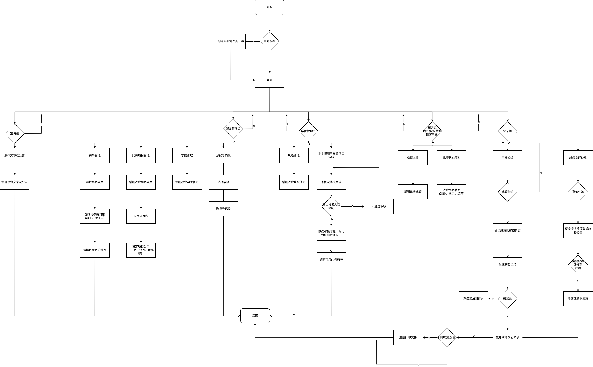
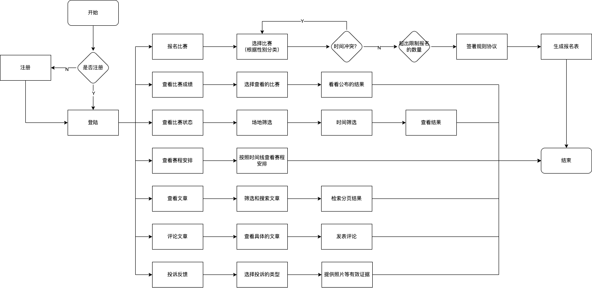

# 运动会系统后端

[前端点这里](https://gitee.com/zgx949/sport-admin)
# 问题分析
> 每年各大中小学及高校基本都会开办校运动会，运动员需要报名，裁判员和管理员需要审核，并且大多数时候需要人工编排比赛，人工记录计算比赛结果，任务重复繁重，而且无法避免错误的产生。并且当今市面上的相关运动会的系统少之又少，价格十分昂贵并且技术选型比较陈旧，不足以满足当今互联网高速发展下的需求，因此本团队调查当今高校运动会举办方的问题需求，进行基本分析。
* 传统纸质报名繁琐复杂，并且无法避免数据信息的错误
  > 各学院在收集运动员信息时，将运动员的个人信息填错，比如性别、姓名、项目、号码牌等。
* 传统纸质信息无法保证数据一致性
  > 在报名填表截止后，运动员出现特殊情况无法参赛，自己临时更改了学院的存档信息，但未通知举办方，导致运动员参赛信息的不一致，最终可能导致秩序册信息与实际信息不一致问题，排查也相当困难。
* 报名灵活性差
  > 各学院的运动员临时出现特殊情况，如受伤严重情况，无法参赛，并且并没有明确替补人员，从而容易导致争议。
* 编排组审核冗杂
  > 编排组人员需要重复审核各学院的报名信息，包括人数、项目、报名人、是否签署协议规定等，以及数据不一致问题，可能导致最终比赛容易出现争议现象，同时也无法避免在繁杂工作的疏忽导致审核上的错误。
* 记录组记录审核效率低，信息实时性差
  > 记录组在收到裁判的成绩记录后，需要人工抄写成绩并做排名，因此十分容易造成错误。并且公开成绩需要人工抄写最终成绩排名，人工输送成绩单，人工贴告示，实时性相当差，耗费了相当大的人力物力财力，效率极低
---

#### 需求分析
* 功能介绍 
* 管理员需求 
* 普通用户需求 
#### 介绍

---
* Spring Boot 现在已经成为Java 开发领域的一颗璀璨明珠，基于Spring Boot作为运动会管理系统的后端程序，实现以下功能，并且还要保证程序的在高并发情况下的可用性和速度，基于上述需求，选择Spring Boot或Spring Cloud作为运动会管理系统再合适不过，因为强大的Spring生态能够在最低成本下达到最高的需求，满足高并发需求，复杂业务逻辑的处理能力等等

* 功能亮点
    1. 解决传统纸质报名的繁琐
* 技术亮点
    1. 除了普通的CRUD功能外，还有复杂的赛事自动编排功能，不再需要人工编排审核，大大降减少赛事编排的冗余工作，提高了编排效率，全自动化
    2. 访问速度快。通过引入Redis缓存，直接读写内存大大提高读取数据的效率，大大减少了IO操作，时间上能够提高近百倍效率
    3. 支持大并发。通过对数据库的读写分离，以及分布式缓存，来保证大并发下的数据访问的速度和准确性
    4. 微服务。后期将整合Spring Cloud来将整个项目分解为一个个粒度更小的项目，提可高维护度和高可拓展性
  

* 分支情况
    1. master：保护的主分支，基于dev分支的无误代码，只有管理员有权限操作
    2. dev：测试分支，开发者修改完代码后pull request的分支
    3. 其他分支
  
---

#### 软件架构
* 软件架构说明
  

* 数据表结构[说明文档](/tables.md)
  
  

#### 安装教程

1.  git clone https://gitee.com/zgx949/sport.git
2.  在IDEA打开
3.  刷新安装maven依赖
4.  运行

#### 使用说明

1.  xxxx
2.  xxxx
3.  xxxx

#### 参与贡献

1.  Fork 本仓库
2.  新建 Feat_xxx 分支
3.  提交代码
4.  新建 Pull Request

#### 特技

1.  使用 Readme\_XXX.md 来支持不同的语言，例如 Readme\_en.md, Readme\_zh.md
2.  Gitee 官方博客 [blog.gitee.com](https://blog.gitee.com)
3.  你可以 [https://gitee.com/explore](https://gitee.com/explore) 这个地址来了解 Gitee 上的优秀开源项目
4.  [GVP](https://gitee.com/gvp) 全称是 Gitee 最有价值开源项目，是综合评定出的优秀开源项目
5.  Gitee 官方提供的使用手册 [https://gitee.com/help](https://gitee.com/help)
6.  Gitee 封面人物是一档用来展示 Gitee 会员风采的栏目 [https://gitee.com/gitee-stars/](https://gitee.com/gitee-stars/)
