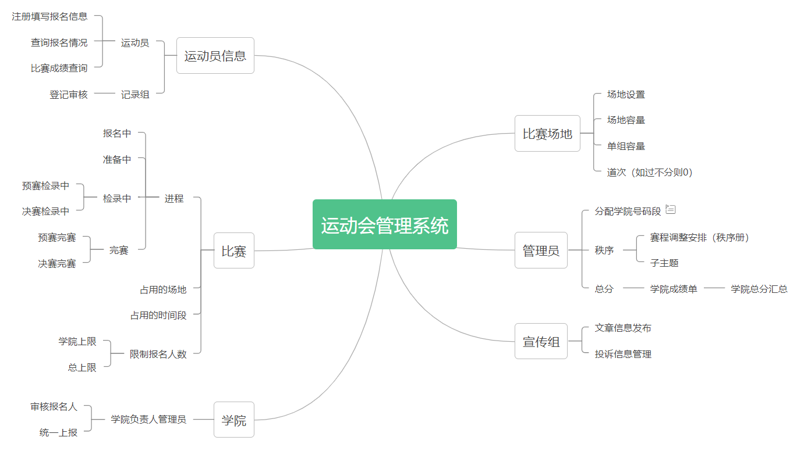
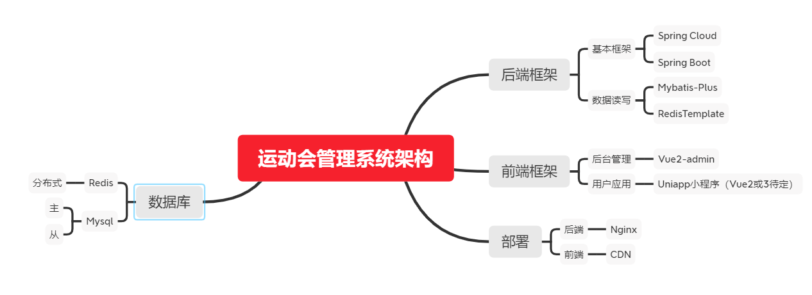
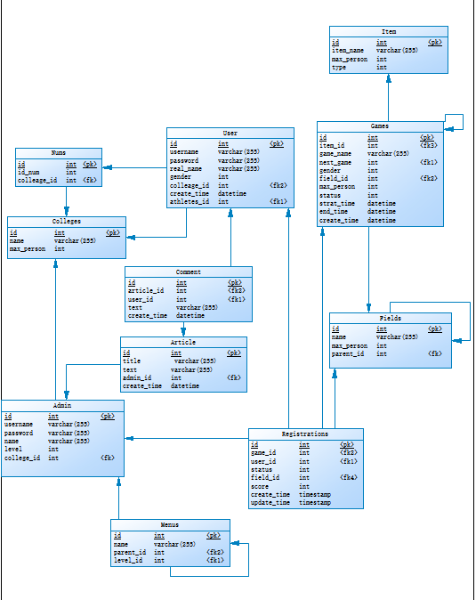

# 运动会系统后端
[前端]()
---

#### 介绍

* Spring Boot 现在已经成为Java 开发领域的一颗璀璨明珠，基于Spring Boot作为运动会管理系统的后端程序，实现以下功能，并且还要保证程序的在高并发情况下的可用性和速度。

* 功能亮点
    1. 除了普通的CRUD功能外，还有复杂的赛事自动编排功能，不再需要人工编排审核，大大降减少赛事编排的冗余工作，提高了编排效率，全自动化
    2. 访问速度快。通过引入Redis缓存，直接读写内存大大提高读取数据的效率，大大减少了IO操作，时间上能够提高近百倍效率
    3. 支持大并发。通过对数据库的读写分离，以及分布式缓存，来保证大并发下的数据访问的速度和准确性
    4. 微服务。后期将整合Spring Cloud来将整个项目分解为一个个粒度更小的项目，提可高维护度和高可拓展性
  

* 分支情况
    1. master：保护的主分支，基于dev分支的无误代码，只有管理员有权限操作
    2. dev：测试分支，开发者修改完代码后pull request的分支
    3. 其他分支
  
---

#### 软件架构
* 软件架构说明
  

* 数据表结构[说明文档](./tables.md)
  
  

#### 安装教程

1.  xxxx
2.  xxxx
3.  xxxx

#### 使用说明

1.  xxxx
2.  xxxx
3.  xxxx

#### 参与贡献

1.  Fork 本仓库
2.  新建 Feat_xxx 分支
3.  提交代码
4.  新建 Pull Request

#### 特技

1.  使用 Readme\_XXX.md 来支持不同的语言，例如 Readme\_en.md, Readme\_zh.md
2.  Gitee 官方博客 [blog.gitee.com](https://blog.gitee.com)
3.  你可以 [https://gitee.com/explore](https://gitee.com/explore) 这个地址来了解 Gitee 上的优秀开源项目
4.  [GVP](https://gitee.com/gvp) 全称是 Gitee 最有价值开源项目，是综合评定出的优秀开源项目
5.  Gitee 官方提供的使用手册 [https://gitee.com/help](https://gitee.com/help)
6.  Gitee 封面人物是一档用来展示 Gitee 会员风采的栏目 [https://gitee.com/gitee-stars/](https://gitee.com/gitee-stars/)
